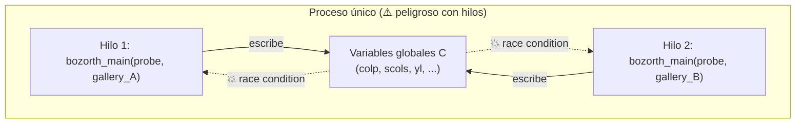
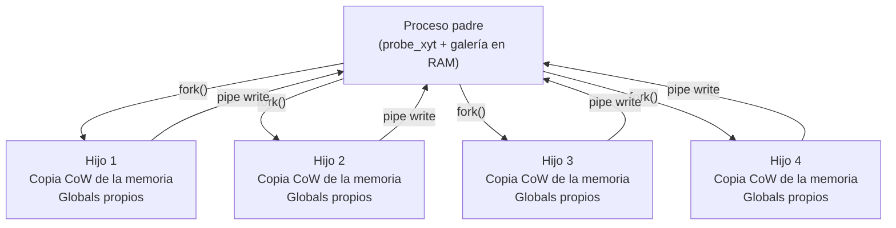
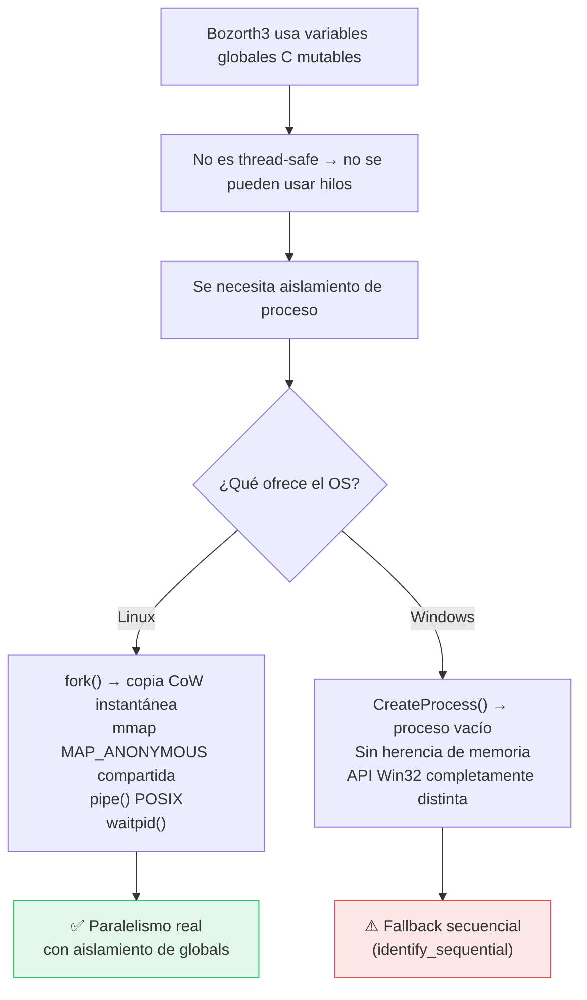

# ¿Por qué `identify_forked` no puede ser la misma función en Linux y Windows?

> [!NOTE]
> Este documento analiza las diferencias de plataforma que obligan al crate
> [`zkfp-match`](file:///home/victormanuelabadpereda/PROYECTOS/fingerprint/crates/zkfp-match/src/lib.rs)
> a tener **dos implementaciones distintas** de `identify_forked`: una
> optimizada para Linux (líneas 590-848) y un fallback secuencial para Windows
> (líneas 853-861).

---

## Resumen ejecutivo

La función `identify_forked` en Linux usa **4 mecanismos exclusivos de POSIX** que no existen en la API Win32:

| # | Mecanismo POSIX | Equivalente Win32 | ¿Drop-in? |
|---|---|---|---|
| 1 | `fork()` — clonar proceso | `CreateProcess()` | ❌ No — no clona memoria |
| 2 | `mmap(MAP_SHARED \| MAP_ANONYMOUS)` | `CreateFileMapping` + `MapViewOfFile` | ❌ Requiere handle explícito |
| 3 | `pipe()` + `read()`/`write()` | `CreatePipe()` + `ReadFile()`/`WriteFile()` | ⚠️ Similar pero API distinta |
| 4 | `waitpid()` | `WaitForSingleObject()` | ⚠️ Semántica diferente |

Pero el problema **no es solo de portabilidad de syscalls**. El problema raíz
es más profundo: **Bozorth3 usa estado global mutable**, lo que hace imposible
usar hilos para paralelizar — y la única manera de aislar ese estado global en
Linux (`fork()`) simplemente no existe en Windows.

---

## 1. El problema raíz: Bozorth3 tiene estado global mutable

El algoritmo Bozorth3 (NIST/NBIS) fue escrito en C en los años 90 y usa
**variables globales estáticas** para su trabajo interno:

```c
// Dentro del código C de bozorth3 (simplificado)
static int colp[COLP_SIZE_1][COLP_SIZE_2];    // tabla de emparejamiento
static int scols[SCOLS_SIZE_1][SCOLS_SIZE_2];  // columnas seleccionadas
static int yl[YL_SIZE_1];                       // buffer de trabajo
// ... decenas de variables globales más
```

Esto significa que:

> [!CAUTION]
> **Dos llamadas concurrentes a `bozorth_main()` dentro del mismo proceso
> corrompen mutuamente sus datos.** El algoritmo **NO es thread-safe**.



### ¿Por qué no se puede simplemente poner un Mutex?

Se podría, y de hecho `nbis-rs` lo hace internamente. Pero un Mutex serializa
todas las llamadas a `bozorth_main()`, eliminando completamente el paralelismo.
Cuando tienes una galería de **20,000+ templates**, esto significa que el
matching 1:N tarda >12 segundos en un ODROID.

---

## 2. La solución en Linux: `fork()` — aislamiento por copia de memoria

Linux resuelve esto con `fork()`, que crea un **clon exacto del proceso**:



### ¿Qué hace `fork()` que es tan especial?

1. **Copia instantánea** de todo el espacio de memoria del proceso (via
   Copy-on-Write del kernel)
2. Cada hijo tiene **su propia copia de las variables globales C** — por lo
   tanto puede llamar a `bozorth_main()` sin interferir con los demás
3. El coste de crear un hijo es **~microsegundos** porque la copia real se
   difiere hasta que se escriba (CoW)

> [!IMPORTANT]
> `fork()` es una syscall **exclusiva de POSIX**. No existe en el kernel de
> Windows (NT). No hay equivalente funcional.

### Código relevante ([lib.rs:712](file:///home/victormanuelabadpereda/PROYECTOS/fingerprint/crates/zkfp-match/src/lib.rs#L712)):

```rust
let pid = unsafe { libc::fork() };

if pid == 0 {
    // ===== CHILD =====
    // Aquí el hijo tiene su PROPIA copia de las variables globales C
    // Puede llamar a bozorth_main() sin race conditions
    let score = probe_xyt.match_score(gxyt); // ✅ seguro
    // ...
}
```

---

## 3. ¿Por qué `CreateProcess()` de Windows NO es equivalente?

| Característica | `fork()` (Linux) | `CreateProcess()` (Windows) |
|---|---|---|
| Hereda memoria del padre | ✅ Sí, copia completa CoW | ❌ No — proceso vacío |
| Copia de variables globales C | ✅ Automática | ❌ Hay que serializar y enviar todo |
| Coste de creación | ~μs (CoW) | ~ms (carga EXE, enlaza DLLs) |
| Acceso a `probe_xyt` y `gallery` | ✅ Inmediato (ya están en RAM) | ❌ Hay que enviarlos por IPC |
| Comparte file descriptors | ✅ Hereda automáticamente | ⚠️ Solo si se marca heredable |

Con `CreateProcess()` en Windows:
- Habría que **serializar** toda la galería y el probe XYT
- Enviarlos al proceso hijo por **named pipe o shared memory**
- El hijo tendría que **deserializar** todo antes de empezar
- El overhead sería **órdenes de magnitud mayor** que `fork()`

---

## 4. Memoria compartida: `mmap` vs Win32

La implementación Linux usa `mmap` con `MAP_ANONYMOUS | MAP_SHARED` para crear
un `AtomicBool` compartido entre padre e hijos — un mecanismo de "early exit"
que señaliza a todos los workers cuando uno ya encontró un match.

### Linux ([lib.rs:682-695](file:///home/victormanuelabadpereda/PROYECTOS/fingerprint/crates/zkfp-match/src/lib.rs#L682-L695)):

```rust
let shared_mem = unsafe {
    libc::mmap(
        std::ptr::null_mut(),
        std::mem::size_of::<AtomicBool>(),
        libc::PROT_READ | libc::PROT_WRITE,
        libc::MAP_SHARED | libc::MAP_ANONYMOUS, // ← solo POSIX
        -1,
        0,
    )
};
```

### Equivalente Windows (hipotético):

```rust
// Windows requiere un HANDLE intermedio
let h = CreateFileMappingW(
    INVALID_HANDLE_VALUE,
    null_mut(),
    PAGE_READWRITE,
    0,
    size_of::<AtomicBool>() as u32,
    null(),
);
let ptr = MapViewOfFile(h, FILE_MAP_ALL_ACCESS, 0, 0, 0);
// ... y luego CloseHandle(h), UnmapViewOfFile(ptr) para limpiar
```

La API es completamente diferente. Además, en Windows el mapping no se hereda
automáticamente por `CreateProcess` — habría que pasar el handle explícitamente.

---

## 5. Pipes y comunicación padre-hijo

### Linux ([lib.rs:707-757](file:///home/victormanuelabadpereda/PROYECTOS/fingerprint/crates/zkfp-match/src/lib.rs#L707-L757)):

```rust
let mut pipe_fds = [0i32; 2];
libc::pipe(pipe_fds.as_mut_ptr());       // crea pipe anónimo
// ...
libc::write(pipe_fds[1], buf.as_ptr() as *const libc::c_void, 16);
libc::read(read_fd, buf.as_mut_ptr() as *mut libc::c_void, 16);
```

### Equivalente Windows:

```rust
let mut read_handle = INVALID_HANDLE_VALUE;
let mut write_handle = INVALID_HANDLE_VALUE;
let mut sa = SECURITY_ATTRIBUTES { /* ... heredable */ };
CreatePipe(&mut read_handle, &mut write_handle, &mut sa, 0);
// ...
ReadFile(read_handle, buf.as_mut_ptr(), 16, &mut bytes_read, null_mut());
WriteFile(write_handle, buf.as_ptr(), 16, &mut bytes_written, null_mut());
```

Si bien los pipes son conceptualmente similares, las APIs son completamente
distintas — tipos, llamadas, manejo de errores, nada es compatible.

---

## 6. Resumen: la cadena de dependencias que lo impide



---

## 7. ¿Qué hace actualmente el código en Windows?

El fallback actual ([lib.rs:850-861](file:///home/victormanuelabadpereda/PROYECTOS/fingerprint/crates/zkfp-match/src/lib.rs#L850-L861)) simplemente delega al path secuencial:

```rust
/// Temporary Windows-safe path.
#[cfg(windows)]
fn identify_forked(
    &self,
    probe_xyt: &CachedXyt,
    gallery: &MemorySearchGallery,
    _num_workers: usize,
) -> IdentifyResult {
    self.identify_sequential(probe_xyt, gallery)
}
```

Esto es **correcto pero lento** — no hay paralelismo, todo se ejecuta en un
solo hilo.

---

## 8. Alternativas futuras para Windows

| Estrategia | Complejidad | Rendimiento esperado |
|---|---|---|
| **Worker processes** con serialización IPC | 🔴 Alta | ~70% de fork() |
| **Recompilar Bozorth3 como thread-local** (`__declspec(thread)`) | 🟡 Media | ~90% de fork() |
| **DLL isolation** — cargar N copias de `bozorth3.dll` en distintos `HMODULE` | 🟡 Media | ~85% de fork() |
| **Job Objects** + `CreateProcess` de un helper `.exe` | 🔴 Alta | ~60% de fork() |
| **WASM sandbox** por worker | 🔴 Muy alta | ~50% de fork() |

> [!TIP]
> La opción más prometedora para Windows es **recompilar el código C de
> Bozorth3 con `__declspec(thread)`** (TLS) para que cada variable global sea
> thread-local. Esto permitiría usar `std::thread` directamente sin necesidad
> de procesos separados, manteniendo un rendimiento cercano al de la versión
> Linux con `fork()`.

---

## Conclusión

No se pueden usar las mismas funciones porque la arquitectura de paralelización
del matching 1:N depende de **primitivas del sistema operativo que son
fundamentalmente diferentes** entre POSIX y Win32. El problema no es cosmético
ni de syntax — es una diferencia arquitectónica a nivel de kernel que afecta
cómo se aísla el estado global mutable de un algoritmo de los años 90.
